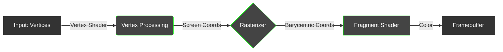

# Z-Render: The High-Performance Software GPU

Z-Render is a zero-dependency, SIMD-accelerated 3D graphics pipeline written in Zig.  
It rejects modern graphics APIs (WebGL, WebGPU, Vulkan) to implement the entire rendering pipeline purely on the CPU, targeting WebAssembly for high-performance browser execution.
> Motto: "No GPU? No Problem. We are the GPU."


🚀 Project Concept  

現代のGPUがハードウェアレベルで行っている処理（頂点変換、ラスタライズ、シェーディング）を、Zig のメモリ制御能力と SIMD 命令を駆使してソフトウェアレベルで再実装します。  
目的は、グラフィックスAPIのブラックボックスを開け、計算機科学的な最適化（キャッシュ局所性、並列処理、ベクトル演算）の極致を学ぶことです。  
🛠 Tech Stack
- Language: Zig (Release Safe/Fast)
- Target: WebAssembly (wasm32-freestanding)
- Key Tech:
  - SIMD: @Vector(4, f32) for massive parallel math.
  - Linear Memory: Direct pixel buffer manipulation.
  - No Allocations: Zero-allocation rendering loop.

🏗 Architecture (Pipeline)  


- Vertex Processing: World/View/Projection 行列演算 (SIMD化)
- Rasterization: 重心座標系 (Barycentric Coordinates) を用いた三角形の塗りつぶし
- Fragment Processing: テクスチャマッピング、ライティング計算
- Output: u32 配列への書き込み -> Canvas (SharedArrayBuffer)
🔥 Technical Challenges (The "Hard" Parts)

1. SIMD-First Rasterization
ピクセルを1つずつ処理するのではなく、4ピクセル（またはそれ以上）をまとめて処理します。
- Goal: エッジ関数（三角形の内外判定）をベクトル命令で一括計算する。

2. Cache-Friendly Texture Mapping
テクスチャデータを単純な配列として保持すると、縦方向のアクセスでキャッシュミスが多発します。
- Solution: Z-Order Curve (Morton Code) を実装し、テクスチャをタイル状にメモリ配置してキャッシュヒット率を最大化します。

3. Tile-Based Multi-Threading
画面をタイル（例: 64x64px）に分割し、複数のWeb Workerで並列描画します。
- Challenge: ロックフリーなタスクキューの実装と、スレッド間の同期コストの最小化。
✅ Todo List & Roadmap

Phase 1: Foundation & Math
- [ ] プロジェクトセットアップ (Zig + Wasmビルド環境)
- [ ] フレームバッファ ([]u32) の作成とJS側への転送
- [ ] SIMD算術ライブラリの実装 (Vec3, Vec4, Mat4)
  - [ ] Dot Product, Cross Product のSIMD化

Phase 2: The Rasterizer (2D)
- [ ] 頂点3つを受け取り、バウンディングボックスを計算する
- [ ] Barycentric Coordinates (重心座標) の実装
- [ ] 三角形の塗りつぶし (単色)
- [ ] 重心座標を使った色の補間 (Gouraud Shadingの基礎)

Phase 3: The 3D Pipeline
- [ ] Model, View, Projection 行列の実装
- [ ] 座標変換パイプラインの構築 (Local -> World -> Clip -> Screen)
- [ ] 深度バッファ (Z-Buffer) の実装
- [ ] Back-face Culling (裏面の描画スキップ)

Phase 4: Shading & Textures
- [ ] UV座標の補間 (Perspective Correct Interpolation)
- [ ] テクスチャ読み込みとサンプリング (Nearest / Bilinear)
- [ ] 基本的なライティング (Lambert / Phong)

Phase 5: Optimization (The Beast Mode)
- [ ] SIMDラスタライザへの書き換え (4ピクセル同時処理)
- [ ] マルチスレッド化 (Web Workers)
- [ ] プロファイリングとボトルネック潰し

🚩 First Milestone: "The Hello World Triangle"
まずは3D計算を無視し、**「2Dの三角形を、爆速で画面に出す」**ことを目指します。
- WasmからJSのCanvasへピクセルデータを転送できること。
- 固定された3つの座標 (x, y) に対し、三角形の内側を赤色で塗りつぶすこと。
- 制約: drawPixel(x, y) のような関数呼び出しをループ内で使わず、ポインタ演算でバッファを直接書き換えること。

Start Command
# Zig build & serve example
```
zig build -Dtarget=wasm32-freestanding -Doptimize=ReleaseFast
python3 -m http.server 8000
```

